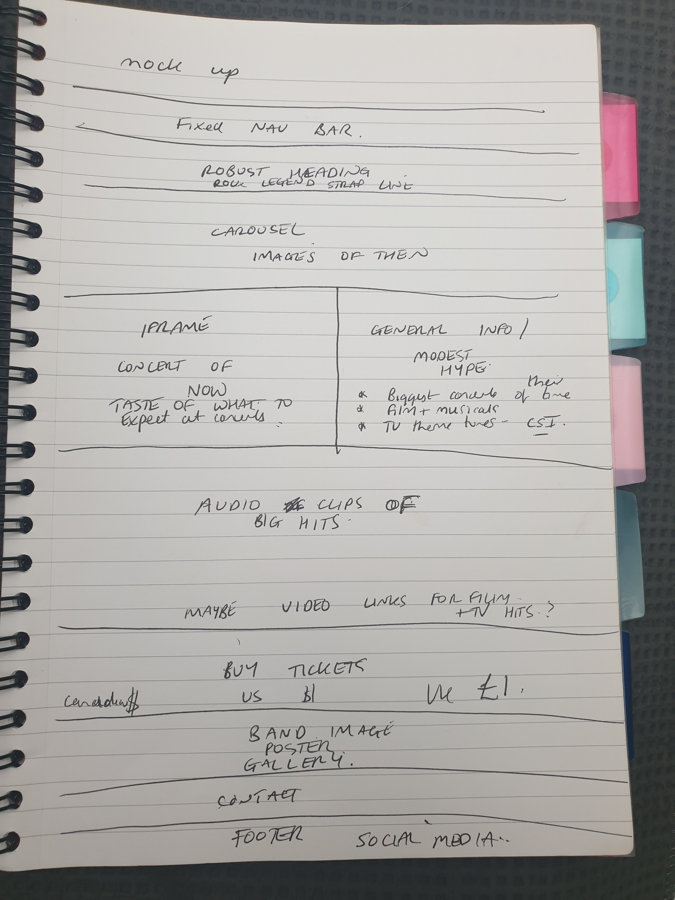
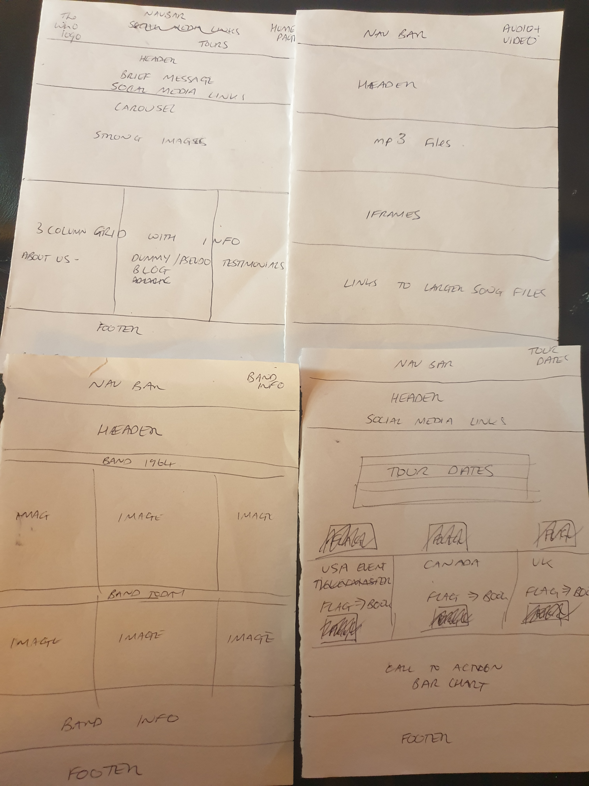

# README.md 

VIEW WEBITE AT GIT PAGES*****************

Milestone project 1, featuring _The Who_.
 
## The Who Website/Ticket sales
This milestone project features the 55 year long career of the  rock band _The Who_. 

_The Who_ became the voice of a generation of angry young men. Their on stage athletics and smashing of instruments swelled 
their fan base.
Their music still features in many aspects of culture today.
In the sixties and seventies  the band members wrote the film soundtrack to 'Tommy.' Tommy evolved into the film 
'Quadrophenia.' The sensitive topics of gang violence and child abuse were aired. 
The Who’s Tommy was turned in to a multi-award winning epic rock musical. 

After seeing them in concert myself last year at Manchester Arena, I appreciated why _The Who_ are rock legends. 
I was a guest and did not consider myself a fan, I was pleasantly surprised. The band's command of the stage and the
audience were impressive and infectious. Roger Daltry's lead vocals are still powerful in 2019.
The band exude energy, with commitment to their performances and do not disappoint despite the original band members being 
70 years old. I wanted to communicate this in a modern site which I hoped could also portray the influential historic importance 
of the band. 

Their main website is a busy, high energy, overly commercial site. I have put together a pared down,
simpler version of a site for ambience and history versus commercialism. The aim was a more simple offering of tour information 
and links for ticket sales with persuasive evidence, images and videos,  that the band is still relevant today.  
The site would hopefully give encouragement to users interested in live music by way of recent 2019 concert images 
and a full 2018 concert video, demonstrating that the band are not resting on hype and previous success to sell tickets. 
. 
  
## UX
**_The strategy plane:_**.
The aim is to create a website that is not as over stimulating and commercialised as _The Who_'s official site. 
In developing the strategy I had in the back of my mind the knowledge that users will be thinking, at all times, 
even if it is at a subliminal level, "Do I like being in here?", "Is it a place I want to return to?". 
 
“A picture paints a thousand words” is often used in marketing to illustrate the need for good images to sell a product. 
I read that an image can communicate instantly, as our brain can interpret them much quicker than text.
I have used swift links and transitions because I prefer them and I believe that the generation of fans for whom the site will be 
most relevant may not have cutting edge technology and hardware to view the site. 

**The business goals** of this website are:
-To showcase the past success and credibilty of the band today.
-To show the band is still compelling today.
-To promote the band, in particular their concert ticket sales. As bands now make less money from record sales than ever
before , their concert ticket sales are crucial to them. 
-To make it intuitively easy to buy tickets on impulse as simply as possible. 
-To provide an option to buy tickets in each of the local currencies of all the tour venues is included. This should give immediate confidence 
and stop the barrier of currency exchange concerns. 
-To all the buy tickets section to be reached quickly either by scrolling to or reaching instantly using the navigation bar links.
-To give buying confidence by offering both the option of a)the major ticket selling sites in case buying from each separate arena's website can distracts the user with adverts for 
other events or sellout dates and potentially lose sales.
or b) by linking to a few examples of the venues, but still ensuring that the user will link directly on to the relevant page to keep focus on The Who.
-Links to social media have been added but positioned after the opportunity to buy tickets but included to show profile and add interest.
-The site needs to go live before the start of the tour to ensure all venues are still available.
-Gathering details via the contact page will help promote future tours and be an indication of how the site has captured the interest of the users.
  
**The customer goals**
The users will be fans of the who or potential fans.
-As a potential fan I want to be reassured that the band is still relevant today. I need to know that the band is not jaded, tired and lacklustre. 
The first sign I would look for would be outdated information. 
-As an older fan, I would like to see pictures to reminisce about the youthful thrill of the times and enjoy memories but if I have older, 
slower hardware and internet speed, immediacy would be important.
-As a younger fan or potential fan I want to feel a sense of the band's past massive sense but also see some evidence of their current credibility as 
performers in spite of the band members ages.
 -As a user, I want to be sufficiently engaged so that I am motivated to perform  action (listening to music or booking a concert tickets), so that I can 
achieve a goal (feeling good or enjoy an event).
-As a user I will want to easily navigate the site, to find what I need efficiently with haste when I am short on time.
-As a user I may be searching for information and images which are of interest to me. I would like to see the past and present 
relevance of the band.
-As a user when looking at images I will subconsiously want to listen to famous tracks. 
The audio mp3 audio files in the body of the site will be important for me to stay on the site.
-As a regular concert attender and live music lover, I want to buy my tickets fast from reliable sellers via an intuitive and visually comforting ordering process.
-Otherwise as an infrequent concert attender , I want to be persuaded that my money will be well spent and that I am not risking disappointment.
-As a user, I want to understand the ordering process, so I know what steps to take next plus I want to order in my local
currency so that I do not have to check exchange rates or find myself booking on foreign sites so having to phone abroad if my tickets do not arrive promptly.
-As a fan I want a very simple contact form, so I can express my interest and learn about future tours or album launches.
-As a fan, I want to follow the band on social media, so I can keep up with their latest news.
-As a returning visitor to the website, I want to be able to go straight to the relevant section of interest.
-As a returning visitor to the website,  I want to be able to buy tickets again knowing I will not be phished 
(there is a whole industry dedicated to sites diverting from authentic ticket sellers- I know this from personal experience).
-As a returning visitor I want my previous familiarity with the site to minimise the time taken to book another ticket. -As a user I personally want to feel good about supporting musicians and song writers in their endeavours so that they remain motivated to tour and make new music 
for us to enjoy.

The features of the site have been developed with all business and user needs and desires being considered. 
The overall strategy is to blend retro and modern information in a visual and informative way using images, video, music, quotes and headings 
with swift navigation and transitions.

**_ scope plane:_**.
Based on information from the strategy plane, a full concert video from their last tour demonstrates that the lead singer still has power in his voice 
and live events will not be a disappointment.

The images have been chosen to create a positive emotional response and fond memories or a sense of retro ambience for a modern appeal. In addition the 
most recent concert images are included.
 
Audio clips being easily available aim to stop the user leaving the site if urged to listen to a famous track.

A simple ticket purchasing process within the body of one page , with minimal decision making makes impulse and intuitive buying an option. 
Minimal clicks and the target blank feature mean that if tickets are not available at a particular venue or dates needed, 
the user can go back on the site and choose again easily.

A contact form to provide future tour details and fan news is included.

The user can navigate by rapid scrolling or swift links. I have used swift links and transitions because I prefer them and I believe that the generation 
of fans for whom the site will be most relevant may not have cutting edge technology and hardware to view the site. 
As regular attender of live concerts and festivals I know that sometimes a quick ticket purchase without frills is what i desire.
This is an assumption which would be adapted quickly after the site goes live and e.g. google analytics evidence that users are leaving the site quickly and contact form has minimal response. 
 
 **_ structure plane:_**
The call to action tour and ticket section is placed first in the navigation bar but further down in the body of the site  . 
 
The thinking being that users may simply want to buy a ticket, using the navigation bar to get there immediately. 
 
Other users may need to be persuaded by images and videos before they believe it is worth spending the money.
 
The structure chosen was to present a simple flow of what users will expect to see on any band website.
 
The social media at the end will mean that users are not distracted and lead away immediately. 
 
 **_ skeleton plane:_**
The skeleton will be a one page site with different sections . The sections will be 
 
-About
-Buy Tickets
-Famous tracks
-Gallery 
-Contact.
 
 I started development of a 5 page site but then decided that there would be limited advantage to a multiple page design with such a tight focus and relatively 
 amount of content. 
 After discussing my rpoject with my mentor I decdied that one page captured all the main content well in different sections.
 
**_ surface plane:_**
 
The black and white images evoke the sense of the band's longevity and pedigree. The colour lifted the site giving it dimension and modernity. 
 
Fonts used are easy to read, up to date choices.

The surface layout is in line with what is currently comfortable, easily absorbed and familiar to users.
 
### Wireframes
At the outset, I intended to complete a design with a 5 page payout. Please find the paper and pen mockup with crossing outs as amendments when I changed my mind while coding the multiple page site.
As the design evolved and with guidance from my mentor, I opted for a one page design.
Please find the latest pen and paper design in mockup file.
Wireframe mockups:

( I started balsamiq design but found my ideas were not free flowing so I reverted back to paper and pen designs which help clarify thoughts more for me.)
 
## Features
 
### Existing Features
-- Bootstrap navbar linking to each section of the site.
The one page project has a section focusing on
_Home_
_About_
_Buy Tickets_
_Famous tracks (audio clips)_
_gallery_
_contact_
 
#### Home
Eye catching front page with simple strap line contained within a bootstrap jumbotron. 
To keep interest and encourage scrolling down there is a carousel with iconic pictures of the band's signature moments. 
The Who were famous for the antics on stage. Particularly Pete Townsend 's jumps with his guitar. 
Plus the band famously smashed up instruments on stage appealing to the sixties mood.
The landing page carousel of atmospheric pictures will hopefully appeal to live music fans. 
Capturing the moments the band is most famous for will hopefully be appreciated by lovers of festivals.
The intention being that the carousel images create interest and evoke mood by including grainy original pictures. 
Instead of changing the vertical height of the third picture I left it raw on smaller screens. I liked the added character of the original authenticity.
On larger screens the different height was too much so I set the height of each image to match using media queries.
A black and white theme is chosen due to the 1960s history.
I did try both the sixties and the later bullseye logo on the nav bar but the look of simplistic original version appeared more in keeping. 
The carousel is a bootstrap component. 
#### About

Information section. 
Iframe containing full colour video of complete 2018 concert is set under the black and white images. 
Alongside is information text explaining the history and containing quotes from bandmembers and song lyrics which show what _The Who_ is about.
An auto start for the video was considered but research revealed that is can be intrusive and so has not proved favourable. 
An unexpected start to an audio or video clip can be annoying, especially when users could be searching at work or in school or in company. 
Attention was given to the quality of the video. The ending is a bit random with Indian music added but the choice of Indian music is gentle and pleasant and not an unpleasant finish.
High quality video should give fans confidence that the concert are still a positive experience without any risk of disappointment. The band members are older and may not look as cool but their voices are powerful.
As there are two dead original band members I did think about honouring them and promoting the new line up but this could make the site borderline on being a memorial and take from the high energy of the site aimed for. 
In addition new band members are usually transient so the site could become quickly outdated.
I focused on the core members who are still going strong with voices and energy that is still impressive.
The text information content is a supportive gesture maintaining focus on the live concert video.
    
#### Buy Tickets
Features 
Tour dates shutterstock image
- Ticket buying
    - buy tickets next to the tour dates of the band so that people can go straight from the website and not look it up separately
    - for the venues rather than independent ticket buying sites, I have ensuresD the link goes directly to the relevant page so that the 
    - user does not get frustrated or distracted trying to navigate the site. Therefore minimising the efforts and number of clicks to then purchase a ticket.
e.g. ticket buying links but the standard blue matches the red blue and white flag and tour themes plus the who bullseye logo. 
I have made the gallery a collage as I think it appeals to the senses and gives a more authentic feel to the page. 
I have not changed things just to prove I can do it for example I can easily change image size and font colour
 
#### Famous Tracks
Background is kept simple as the appearance with a background image or wallpaper was not as attractive within the overall site. It was noted that the audio controls loaded with purple spot colour in Internet explorer browser. 
With the simple background this looked aesthetic and the functionality remained in tact so no html or css amendments were made to alter this.
The famous tracks section includes. 
- 6 Audio song clips. Using audio control to play popular songs in mp3 format. Allows users to listen to popular songs by the band from within the site. 
- 6 audio clips were chosen for their small file size, variety of styles and familiarity. Plus they are slightly different from other tracks which are at the forefront of social media.
 
#### Gallery 
The poster image at the top of the gallery was intended to convey youthful prowess. Marketing often concludes that images of attractive faces are what users engage with. 
The image of heady days was initially chosen before I decided which type of gallery most suited the site. With extensive experimentation, I eventually favoured the collage style popular in the band's hayday.
The woman's legs on pete townsend are deliberate for humour and never taking themselves too seriously 
 I have made the gallery a collage as I think it appeals to the senses and gives a more authentic feel to the page. 
I have not changed things just to prove I can do it for example I can easily change image size and font colour
- Photo gallery
- Allows users to view photos of the band members and their characters. There is a collage of old and new photos. Monochrome and colour pictures have been blended for interesting contrast.  
- The background image attempts to convey the influence and popularity of the band in the sixties. Woodstock was a historic music event which rippled through the world, 
possibly giving rise to the popularity of festivals today. The background image is a picture of the crowd at Woodstock.
- The poster image at the top of the gallery is resized for different screen sizes. Media queries removed the oversized image responsively.
- Recent 2018 images live in action on stage at new year 2019 would hopefully create interest in seeing the band live on tour this year. 
 
#### Contact Bootstrap component form amended password for text box and remove check box 
- Contact form
    - Contact form for users interested in receiving future tour information and fan club information. 
    - Required input field for email and small text field for short message. 
    - Submit button will advise the user if they have inputted the password incorrectly. 
 
#### Footer 
Home Link to the home part of the page.
Social media link via font awesome icons.
 
 
 
  
 
 ### Future Features
extra audio clips 
 
Features Left to Implement
extra audio clips 
modal thanking for ticket enquiry and purchase. 
 
 As a potential client, I want to view expected prices for a portrait, so I can decide if it is within my budget to order.
- 
As a potential client, I want to know what past clients thought of their artwork and the service they received.

## Tech Used
-Cloud9 - IDE used throughout development.
-HTML - This was used to create the markupl
-CSS - This was used to style the elements of the HTML code.
-Bootstrap - https://maxcdn.bootstrapcdn.com/bootstrap/4.3.1/css/bootstrap.min.css   
        - This was used to help style the website and as well as the grid layout.
-Font Awesome
   -https://fonts.googleapis.com/css?family=Lato:400,400i,700,700i,900|Audiowide|Ubuntu&display=swap" rel="stylesheet">
    - This was used to create a choice of fonts for the website
   -https://stackpath.bootstrapcdn.com/font-awesome/4.7.0/css/font-awesome.min.css
    - This was used for icons e.g. social media and flags 
-Hover        
    - https://cdnjs.cloudflare.com/ajax/libs/hover.css/2.3.1/css/hover-min.css
        - This was used to have the hover styles run smoothly
-Gimp- This was used for resizing, cropping, fading and changing images to fit the site. 

-Jquery, JS and poppers
   -https://code.jquery.com/jquery-3.3.1.slim.min.js">
      -This added functionality to the site e.g. naivation toggle.
   -https://cdnjs.cloudflare.com/ajax/libs/popper.js/1.14.7/umd/popper.min.js
   -https://stackpath.bootstrapcdn.com/bootstrap/4.3.1/js/bootstrap.min.js"
      -supports logic for use of the bootstrap components within the site.     
-Git - used for version control and deployment.
-AutoPrefixer - https://autoprefixer.github.io/
  -This project used AutoPrefixer to make sure the css code is valid for all browsers.
-Markdown live preview - https://markdownlivepreview.com/ 
  -This project used markdwon previewer to check the rendering of the readme.md file content.
 
## Reference
-As a complete beginner to coding I need to read, watch and listen to a wealth of additional resources.

These included
-1.Get coding, published by Walker, supported by Young rewired state.
-2.Learn CSS in one day and learn it well by Jamie Chan
-3. The smart way to learn html and CSS by Mark Myers
-4. Audiobook Programming for beginners : 6 books in one including CSS HTML and Javascript
-5. I used w3schools extensively. Quizzes, exercises and lessons.
-6. Tutors and Mentors at CI. repeated coursework, quizzes a number of times.
-7. I watched numerous tutorials on YouTube. 
-8. Slack and Stack community support.
 
## Testing
HTML and CSS validators were used througout development. 

[HTML Validator](https://validator.w3.org/.)
[HTML Validator](https://validator.w3.org/#validate_by_input)
[CSS VALIDATOR](http://www.css-validator.org/)

[Markdown test](https://markdownlivepreview.com/)

ALL LINKS TESTED to external website social emdia etc

 Each time I was happy with the functionality of a section I checked the code .
 I tested repeatedly using developer tools and in different browsers. 
 Sometimes the difference in presentation between browsers was attractive enough not to necessitate change, for example, 
 the audio controls are very different between browsers but still look good and function well. 
 I put forward my code to be tested in a slack online call session where the lead student pointed out various mistakes in the responsive design that I had not picked up in developer tools. 
 I posted my code for peer review in slack . I asked lead students, tutors and mentors to check the code for anything clearly out of sync. My mentor picked up an error in the console of dev tools which showed an image was not loading. 
 I commented out the background image that was redundant in the design to test if it was important in any way.
 I constantly commented out changes before deleting amendments permanently in case anything unpredictable happened.
 I often ran tests e.g. ) padding:3000px so that subtle changes were not missed.
 My final html validator result showed two errors. One for the iframe width which uses a % rather than px or em. 
 I did not want to change it because it was working and resizing in different screens so well. 
 The response from other students in slack and CI tutor was that
 width % is acceptable so I left it.
 The only other error shown by the validator in the final code that I did not correct was the link listing the different fonts I had used. 
 I looked online for the solution to combining the fonts in to one url link. I then asked in slack. Both came up with the same solution which worked. 
 That is |between fonts. 
 All CSS errors were corrected. 
 
ALL THE LINKS ON THE SITE AND CONTACT FORM were tested throughout. 
Final tests were made using
AutoPrefixer
This project used AutoPrefixer to make sure the css code is valid for all browsers.

Google Chrome
Google
Bing
Ask Jeeves
Safari
Internet Explorer
Mozilla Firefox

Final Developer Tools texts completed for all screen sizes.

Devices used for testing included
Mobile phones
Samsung S6
Iphone 6
Iphone 7S
Sony Xseries

Tablets used
Ipad 

Laptop
Macair
Hp
Sony Vaio

Desktop (unbranded Windows 7 OS)
with different monitors 21, 27 and 43inches.

## Version control
I began the project with the focus being the band Herman and the Hermits. 
I then decided to develop my project outside the band brief, I discussed ideas with my mentor to ensure the scope 
would be similar to that of the example band brief. 
As my project outside the brief developed I was struggling to develop the asset and social media contact alongside 
development.
I then decided I would concentrate on the coding skills improvement rather than being distracted trying to make original content.
Research showed an abundance of readily available assets and social media presence for **_THE WHO_**. 
I set out and wrote wireframes for a 5 page site . 
As I experimented with the responsive mobile first, approach I considered that a one page site could feature all the essential elements.
I was undecided when I began developing the one page site so left the original workspace in tact in case I wanted to return to it. 
For this reason early development is in a number of git repositories.
 
Early work -
https://github.com/samathaluca/milestone1.git (5 Commits)
https://github.com/samathaluca/project2.git   (3 Commits)
https://github.com/samathaluca/who.git    (2 Commits)
 
Initially I  did not grasp how important evidence of version control was but have concentrated on this since grasping how imperative a part of developement this is.
The finished project git commits were numerically names at first 
 -a) because I had not fully understood the number of commits I would be making 
 -b) there was so much development work to be done and code was so rudimentary at first that is was only going to be a referenced unless all the work was lost. 
As the coding improved I started to understand that naming the commit messages with relevance was important.
I also only realised how important the commit message was recently.
Please can the number of early commits be considered. Also please consider that the error made in the lack of specificity applied to the git  commit messages 
( plus error duplicate commit number 6/8) in usable workplace be considered part of the learning process which I will now ensure 
is rectified in the future. 
The original workplace was https://ide.c9.io/samgore/who-milestone. 4 Git commits.
 
********** The final project workspace is 
# Find out our current directory
pwd
 
# List the contents of the directory
ls
 
# Create a new local git repository
git init
# Check for the existence of the `.git` directory
ls -a
 
# Add the `css` directory and each of the `.html` files to
# the git staging area
git add css/ stream-*.html
 
# Check the git status to double-check that they've been
# added
git status
 
# Do our first commit
git commit -m "Initial commit"
 
# Add a remote
git remote add origin https://github.com/aaroncistudent/my-first-website.git
 
# Push from our local repository to the remote
git push -u origin master

####  Content
The text for 
the about section was copied from the Wikipedia article about the Who.
Media
Video was obtained from youtube.com
The photos used in this site were obtained from google images.
Audio clips used were provided by ......... spotify 
Acknowledgements
I received inspiration for this project by searching the world's 25 best band websites. 
I like the black and white carousel and mood of the Alice in Chains site by Vandalay productions which evolved in to colour. 
I thought that fitted with the fact that the who launched their career when black and white TV was available. 
also ws schools
 
also www3 templates made me tackle from blank sheet. Lathough i did not eventually use anything from the template it got something working in my ide.
 
####  Credits
No section is copied . each section is inspired by a mix ...........
 

 

 
Depolyment
 Log into GitHub.
From the list of repositories on the screen, select AJGreaves/portrait-artist.
From the menu items near the top of the page, select Settings.
Scroll down to the GitHub Pages section.
Under Source click the drop-down menu labelled None and select Master Branch
On selecting Master Branch the page is automatically refreshed, the website is now deployed.
Scroll back down to the GitHub Pages section to retrieve the link to the deployed website.
At the moment of submitting this Milestone project the Development Branch and Master Branch are identical.
 
How to run this project locally
To clone this project from GitHub:
 
Follow this link to the Project GitHub repository.
Under the repository name, click "Clone or download".
In the Clone with HTTPs section, copy the clone URL for the repository.
In your local IDE open Git Bash.
Change the current working directory to the location where you want the cloned directory to be made.
Type git clone, and then paste the URL you copied in Step 3.
git clone https://github.com/USERNAME/REPOSITORY
Press Enter. Your local clone will be created.
Further reading and troubleshooting on cloning a repository from GitHub here.
 

 

Deployment
This project was developed using the Cloud9 IDE, committed to git and pushed to GitHub using the built in function within cloud9.

To deploy this page to GitHub Pages from its GitHub repository, the following steps were taken:

Log into GitHub.
From the list of repositories on the screen, select AJGreaves/portrait-artist.
From the menu items near the top of the page, select Settings.
Scroll down to the GitHub Pages section.
Under Source click the drop-down menu labelled None and select Master Branch
On selecting Master Branch the page is automatically refreshed, the website is now deployed.
Scroll back down to the GitHub Pages section to retrieve the link to the deployed website.
At the moment of submitting this Milestone project the Development Branch and Master Branch are identical.

How to run this project locally
To clone this project from GitHub:

Follow this link to the Project GitHub repository.
Under the repository name, click "Clone or download".
In the Clone with HTTPs section, copy the clone URL for the repository.
In your local IDE open Git Bash.
Change the current working directory to the location where you want the cloned directory to be made.
Type git clone, and then paste the URL you copied in Step 3.
git clone https://github.com/USERNAME/REPOSITORY
Press Enter. Your local clone will be created.
Further reading and troubleshooting on cloning a repository from GitHub here.

 
 

 
 
 
 

 

 
 
 

 
 
 
Project Purpose.
UX design.
Suitability for purpose.
Navigation.
Ease of Use.
Information Architecture
Responsive Design
Image Presentation.
Colour scheme and typography.
Appropriate use of HTML.
Appropriate use of CSS.
Directory Structure and File Naming.
Version Control.
Testing implementation.
Testing write-up.
Readme file.
Comments.
Deployment implementation.
Deployment write-up

Deployment
This project was developed using the Cloud9 IDE, committed to git and pushed to GitHub using the built in function within cloud9.
 
To deploy this page to GitHub Pages from its GitHub repository, the following steps were taken:
 

 

 
 

----
## usage
1. Write markdown text in this textarea.
2. Click 'HTML Preview' button.

----

* list

>block quote

  

